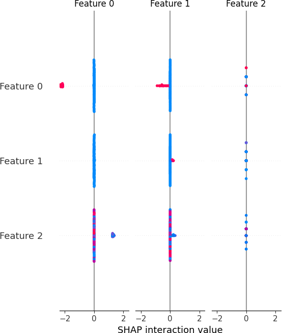
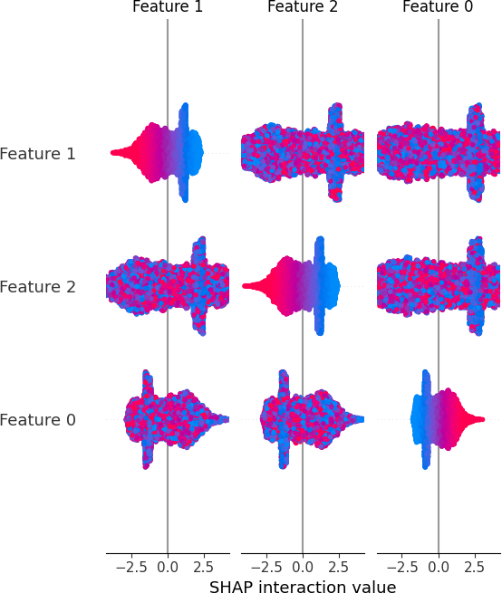

# Automated Insurance Claim Fraud Detection System

## Project Overview

This project aims to detect fraudulent insurance claims using machine learning techniques. The system enhances the security and efficiency of the insurance claims process by identifying potentially fraudulent claims.

## Key Features

### Data Ingestion and Preprocessing
- **Local Dataset**: Utilizes a simulated dataset of insurance claims stored in JSON files within the `Simulation/Data` directory. The dataset includes features such as claim amount, claimant history, claim type, and timestamps.
- **Data Cleaning and Preparation**: Employs Python and Pandas to clean and preprocess the data, handle missing values, normalize features, and create new features like claim frequency.

### Machine Learning Integration
- **Model Training**: Trains a neural network model using the simulated claims dataset to predict the likelihood of a claim being fraudulent. The model, named `EnhancedFraudDetectionModel`, is a multi-layer feedforward neural network with 5 layers. The training process involves the following steps:
  1. **Data Loading and Preprocessing**: The training data is loaded from JSON files, and features are extracted from each claim. The dataset is then balanced using SMOTE (Synthetic Minority Over-sampling Technique) to handle class imbalance.
  2. **Model Initialization**: The `EnhancedFraudDetectionModel` is initialized, which includes defining the architecture with layers, batch normalization, and dropout for regularization.
  3. **Loss Function and Optimizer**: The model uses Cross-Entropy Loss as the loss function and the Adam optimizer for training.
  4. **Training Loop**: The model is trained for 100 epochs. In each epoch, the optimizer resets gradients, performs a forward pass to compute predictions, calculates the loss, performs a backward pass to compute gradients, and updates the model parameters.
  5. **Model Saving**: After training, the model's state dictionary is saved to a specified path for later use.
- **SHAP Analysis**: Uses SHAP (SHapley Additive exPlanations) to interpret the model's predictions and understand the impact of each feature on the fraud likelihood score.

<div style="text-align: center;">
  <h3>Small Sample SHAP Summary Plot</h3>
      
  <h3>Varied-Distribution Sample SHAP Summary Plot</h3>
      
</div>

### System Architecture
- **File-Based Design**: The system uses a file-based approach for data processing and model predictions, ensuring simplicity and ease of use.
- **Python Scripts**: All functionalities, including data ingestion, rule-based analysis, and machine learning predictions, are implemented using Python scripts.
- **CLI Interface**: Exposes the fraud detection capabilities via a Command Line Interface (CLI), allowing users to run scripts for data processing and model training.

### Frontend Interface
- **Dashboard**: Develops a web dashboard using .Net MVC (C#) and HTML/JavaScript to display the results of the fraud detection process, including visualizations of flagged claims and their associated fraud scores.

    

## Key Technologies

- **Languages**: Python, C#
- **Frameworks**: ASP.NET MVC for the backend and frontend, Torch and Shap for machine learning
- **Data Management**: Pandas for data processing, JSON for local data storage
- **Web Development**: HTML5, CSS, JavaScript

## Outcome

The Automated Insurance Claim Fraud Detection System offers a unique, valuable solution that extends beyond typical platform features. It not only showcases proficiency in Python and machine learning but also demonstrates the ability to solve complex problems and enhance the security of the insurance claims process.

## User Guide

### Getting Started

1. **Clone the Repository**:
   ```bash
   git clone https://github.com/tylermaginnis/AutomatedInsuranceClaimFraudDetection.git
   cd AutomatedInsuranceClaimFraudDetection
   ```

2. **Set Up the Environment**:
   Ensure you have Python installed. Create a virtual environment and install the required dependencies:
   ```bash
   python -m venv venv
   source venv/bin/activate  # On Windows use `venv\Scripts\activate`
   pip install -r requirements.txt
   ```

3. **Prepare the Data**:
   Generate the simulated dataset:
   ```bash
   python Simulation/Generator.py -n 1000 -p 100
   python Simulation/Generator.py -a -n 1000 -p 100
   ```

4. **Run the Web Dashboard**:
   Navigate to the `MLDashboard` directory and run the Flask application:
   ```bash
   cd MLDashboard
   dotnet run
   ```

### Using the System

1. **Access the Dashboard**:
   Open your web browser and go to `http://127.0.0.1:5000`. You will see the main dashboard displaying key metrics and visualizations.

2. **View Detailed Visualizations**:
   Click on the different sections of the visualizations menu to explore various charts and graphs, such as claims by coverage type, claims over time, and fraud risk analysis.

3. **Review Fraud Scores**:
   In the "Claims Fraud Risk" section, review the list of claims along with their fraud likelihood scores. Click on "View Details" to see more information about a specific claim.

### Customizing Rules

1. **Update the Machine Learning Model**:
   If you want to retrain the machine learning model with new data or different parameters, modify the `Generator.py` or `MLTool.py` script and run it to update the model.

### Additional Resources

- **Support**: If you encounter any issues or have questions, please open an issue on the GitHub repository or contact the project maintainers.

By following this user guide, you will be able to set up, use, and customize the Automated Insurance Claim Fraud Detection System effectively.
